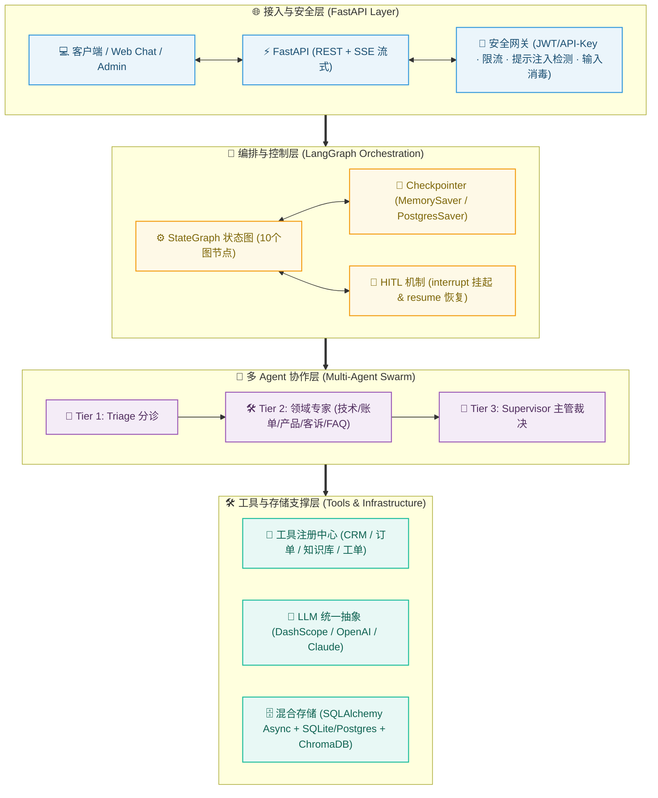
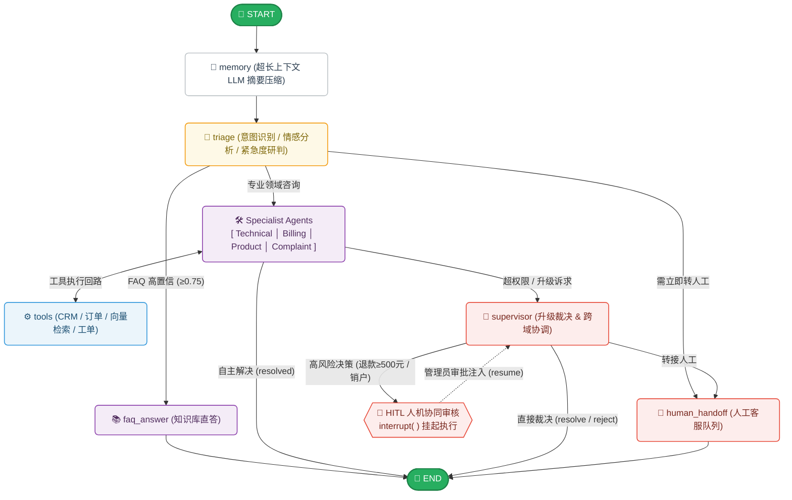
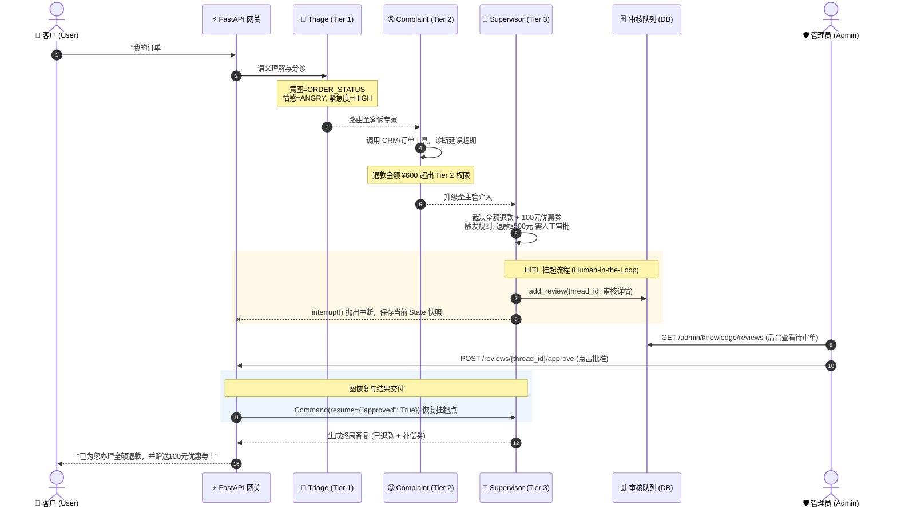

# Multi-Tier Customer Service System

多层级智能客服协同系统 — 基于多 Agent 协作的生产级客服系统。

## 功能特性

- 🧠 **三层 Agent 协作**：Triage 分诊 → 4 个 Specialist 专业处理 → Supervisor 升级审核 → 人工转接，完整闭环
- 🔀 **LangGraph 编排**：10 个图节点（含会话记忆摘要、工具执行循环）+ 条件路由 + Checkpointer 状态持久化
- 🔌 **LLM 供应商无关**：DashScope / OpenAI / Claude 三 Provider 可插拔，支持结构化输出 + 自动重试
- 📚 **RAG 知识问答**：ChromaDB 向量检索，高置信度（≥0.75）直答 FAQ，低置信回落 LLM
- 🛠 **HITL 人工审核**：高风险决策（退款 ≥500 元等）自动挂起，等待人工审批后恢复
- 🖥 **管理后台**：在线管理模型配置（热更新）、FAQ、知识库、人工审核队列
- 🔐 **安全防护**：JWT 认证、API Key 双轨鉴权、Prompt Injection 检测、输入消毒、限流

## 架构概览

### 1. 系统分层架构



### 2. LangGraph 状态图与工作流拓扑



### Agent 层级

| 层级 | Agent | 职责 | 默认模型 |
|------|-------|------|---------|
| Tier 1 | **TriageAgent** | 意图识别、情感分析、紧急度判断、路由决策 | qwen-turbo |
| Tier 2 | **TechnicalAgent** | 技术问题诊断、排查指导、订单状态查询 | qwen-turbo |
| Tier 2 | **BillingAgent** | 账单查询、退款处理、账户管理 | qwen-turbo |
| Tier 2 | **ProductAgent** | 产品咨询、对比推荐、使用指导 | qwen-turbo |
| Tier 2 | **ComplaintAgent** | 投诉处理、情绪安抚、补偿方案 | qwen-turbo |
| Tier 3 | **SupervisorAgent** | 升级审核、终局决策、人工转接判定 | qwen-plus |

> 模型分层策略：分诊/处理用快模型（成本优先），主管决策用强模型（效果优先）；可在管理后台热更新，无需重启。

### 端到端协同与 HITL 流程示例



## 快速启动

### 1. 环境准备

```bash
# 克隆/进入项目
cd customer-service

# 创建虚拟环境
python -m venv venv
source venv/bin/activate  # Windows: venv\Scripts\activate

# 安装依赖
pip install -e .
```

### 2. 配置

```bash
# 复制配置模板
cp .env.example .env

# 编辑 .env，填入你的 API Key
# LLM_PROVIDER=dashscope     # dashscope | openai | claude
# DASHSCOPE_API_KEY=sk-xxx   # 阿里云 DashScope
# OPENAI_API_KEY=sk-xxx      # OpenAI
# ANTHROPIC_API_KEY=sk-ant-xxx  # Claude
```

> 开发环境默认使用 SQLite（零配置），无需安装 PostgreSQL；`DASHSCOPE_API_KEY` 同时用于 FAQ 向量嵌入（text-embedding-v1）。

### 3. 启动服务

```bash
# 开发模式（热重载）
uvicorn src.main:app --reload --host 0.0.0.0 --port 8000

# 或直接运行
python src/main.py

# 或使用 Makefile
make run
```

### 4. 访问

- **Web 聊天界面**: http://localhost:8000/
- **管理后台**: http://localhost:8000/admin （默认账号 `admin` / `admin123`，建议首次登录后修改）
- **Swagger UI**: http://localhost:8000/docs
- **ReDoc**: http://localhost:8000/redoc
- **健康检查**: http://localhost:8000/health

## API 使用

### 创建会话 → 对话

```bash
# 1. 创建新会话
curl -X POST http://localhost:8000/sessions \
  -H "Content-Type: application/json" \
  -d '{"customer_id": "cust_001"}'

# 返回: {"session_id": "sess_abc123...", ...}

# 2. 发起对话
curl -X POST http://localhost:8000/chat/sess_abc123 \
  -H "Content-Type: application/json" \
  -d '{"message": "我的订单还没收到，已经等了5天了！"}'

# 返回: {"session_id": "...", "reply": "...", "agent_name": "complaint", "intent": "order_status", ...}

# 3. 获取对话历史
curl http://localhost:8000/chat/sess_abc123/history
```

### SSE 流式对话

```bash
curl -N http://localhost:8000/chat/sess_abc123/stream?message=我的App一直闪退
```

### 工单

```bash
# 创建工单
curl -X POST http://localhost:8000/tickets \
  -H "Content-Type: application/json" \
  -d '{"session_id": "sess_abc123", "subject": "订单未发货", "description": "已等待5天", "priority": "high"}'

# 查询工单
curl http://localhost:8000/tickets/ticket_xxx
```

### 管理端 API

```bash
# 1. 管理员登录（获取 JWT）
curl -X POST http://localhost:8000/admin/login \
  -H "Content-Type: application/json" \
  -d '{"username": "admin", "password": "admin123"}'

# 2. 查看/更新模型配置（热更新，无需重启）
curl http://localhost:8000/admin/model-config
curl -X PUT http://localhost:8000/admin/model-config \
  -H "Authorization: Bearer <token>" \
  -H "Content-Type: application/json" \
  -d '{"agent": "supervisor", "model": "qwen-plus"}'

# 3. FAQ 增删改查
curl http://localhost:8000/admin/faqs
curl -X POST http://localhost:8000/admin/faqs \
  -H "Authorization: Bearer <token>" \
  -H "Content-Type: application/json" \
  -d '{"question": "如何退货？", "answer": "在订单页申请退货...", "category": "order"}'

# 4. 知识库管理（上传文档 → 自动解析/分块/向量化）
curl -X POST http://localhost:8000/admin/knowledge/upload \
  -H "Authorization: Bearer <token>" \
  -F "file=@policy.md"
curl http://localhost:8000/admin/knowledge/documents

# 5. 人工审核队列（HITL：高风险决策挂起后在此审批/驳回）
curl http://localhost:8000/admin/knowledge/reviews
curl -X POST http://localhost:8000/admin/knowledge/reviews/{thread_id}/approve \
  -H "Authorization: Bearer <token>"
curl -X POST http://localhost:8000/admin/knowledge/reviews/{thread_id}/reject \
  -H "Authorization: Bearer <token>"
```

## Docker 部署

```bash
# 启动 PostgreSQL(pgvector) + App
docker-compose up -d

# 查看日志
docker-compose logs -f app

# 停止
docker-compose down
```

## 项目结构

```
customer-service/
├── config.py                 # 配置中心（.env > 环境变量 > 默认值）
├── .env.example              # 环境变量模板
├── pyproject.toml            # 依赖管理
├── docker-compose.yml        # Docker 编排（pgvector:pg16 + App）
├── Dockerfile                # 应用镜像
├── Makefile                  # run / test / clean 快捷命令
├── src/
│   ├── main.py               # FastAPI 入口 + 生命周期管理
│   ├── state.py              # LangGraph 状态定义（TypedDict + reducer）
│   ├── llm/                  # LLM 抽象层（3个 Provider + 工厂 + 重试）
│   ├── models/               # Pydantic 数据模型
│   ├── agents/               # Agent 层（6个 Agent，继承 BaseAgent）
│   ├── tools/                # 工具注册中心（crm/order/knowledge/ticket）
│   ├── graph/                # LangGraph 工作流（10 节点 + 条件路由 + checkpointer）
│   ├── memory/               # 持久化（会话/消息/工单/FAQ/审核/模型配置）
│   ├── knowledge/            # 知识库（解析→分块→向量化→检索 流水线）
│   ├── api/                  # FastAPI 路由/认证/安全/存储/审核队列
│   ├── static/               # Web UI（chat.html 聊天 / admin.html 管理后台）
│   └── utils/                # 上下文窗口管理工具
├── migrations/               # Alembic 数据库迁移
├── tests/                    # 83 个自动化测试 + evals/ 意图评估集
└── data/                     # FAQ 示例数据（faq_samples.json / sample_policy.md）
```

## 运行测试

```bash
pytest tests/ -v               # 全部测试（83 个）
pytest tests/test_llm.py -v    # LLM 层测试
pytest tests/test_workflow.py -v  # 工作流集成测试
pytest tests/test_api.py -v    # API 集成测试
pytest tests/test_telemetry.py -v  # 可观测性埋点测试
```

## 离线评估

基于 50 条真实意图标注样本（覆盖 9 类意图）评估 Triage Agent 的分诊能力。

```bash
# 完整评估（真实 LLM 调用，默认并发 5）
python -m tests.evals.eval_intent --save

# 小批量试跑
python -m tests.evals.eval_intent --limit 10

# 不调 LLM，仅验证脚本
python -m tests.evals.eval_intent --dry-run
```

> 评估脚本支持 `--concurrency` 并发参数（默认 5），50 条样本约 1 分钟跑完。
> 报告输出到 `tests/evals/reports/`（含混淆矩阵与分类别准确率）。

### 评估结果（最新）

| 指标 | 优化前 | 优化后 |
|------|--------|--------|
| 意图识别准确率 | 74.00% | **78.00%** |
| 路由准确率 | 76.00% | **78.00%** |
| 平均置信度 | 0.91 | 0.91 |

关键类别准确率变化：

| 类别 | 优化前 | 优化后 |
|------|--------|--------|
| billing_account | 50% | **100%** |
| account_issue | 50% | **100%** |
| order_status | 80% | 100% |

优化说明：通过错误分析发现 `faq` 意图被过度预测（吞掉 billing/refund/account_issue），
针对性收窄 FAQ 定义、增加"具体意图优先于 faq"的判定规则后重跑。

## 技术栈

| 层 | 技术 |
|---|---|
| 编排 | LangGraph (StateGraph + Checkpointer + interrupt) |
| LLM | DashScope / OpenAI / Claude（统一抽象 + 结构化输出） |
| API | FastAPI + SSE 流式 + Web UI |
| 存储 | SQLite(开发默认) / PostgreSQL(生产)，DB 故障自动降级内存 |
| 向量检索 | ChromaDB + text-embedding-v1（1536 维） |
| 认证 | JWT + bcrypt + API Key 双轨鉴权 |
| 迁移 | Alembic |
| 测试 | pytest + pytest-asyncio |

## 设计原则

- **低耦合**: Agent 只通过 State 和 Tool Registry 交互
- **高内聚**: 每个 Agent 自包含（prompt + tools + schema），独立可测
- **可扩展**: 新增 Agent = 写类 → 注册节点 → 添加路由
- **降级优先**: DB 不可用自动降级内存，LLM 失败友好降级，服务不中断
- **防失控**: 升级轮次上限 + 工具执行轮次上限 + 限流
- **可观测**: 全链路日志 + Agent 错误追踪
- **生产就绪**: 异步全链路、连接池、优雅关闭、健康检查